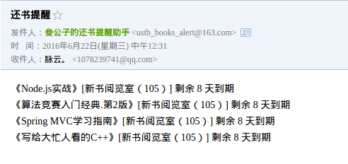

# ustb_book_reminder
USTB图书馆还书提醒，http://lib.ustb.edu.cn:8080/reader/login.php
## 效果

## 说明
使用语言：go语言
使用数据库：mysql

## 部署流程
### 数据库
#### 创建数据库
``` sql
CREATE DATABASE ustb_book_reminder DEFAULT CHARACTER SET utf8 COLLATE utf8_general_ci;
```
#### 创建表
``` sql
USE ustb_book_reminder;
CREATE TABLE IF NOT EXISTS `users` (
  `id` int(11) NOT NULL AUTO_INCREMENT,
  `username` varchar(255) DEFAULT NULL,
  `password` varchar(255) DEFAULT NULL,
  `mail` varchar(255) DEFAULT NULL,
  PRIMARY KEY (`id`)
) ENGINE=InnoDB  DEFAULT CHARSET=utf8 AUTO_INCREMENT=3 ;
```
#### 插入需要提醒的用户
``` sql
INSERT INTO `users` (`id`, `username`, `password`, `mail`) VALUES
(1, '用户名1', '密码1', '提醒的邮箱1'),
(2, '用户名2', '密码2', '提醒的邮箱2');
```

### 安装
``` go
go get -u github.com/Go-SQL-Driver/MySQL
go get -u github.com/jinzhu/gorm
go get -u github.com/nladuo/ustb_book_reminder
```

### 修改配置
见crontab.go与model/mail.go

### crontab配置
编译crontab.go
``` shell
go build $GOPATH/src/github.com/nladuo/ustb_book_reminder/crontab.go
```
见/etc/crontab, 每天七点半提醒
``` shell
# m h dom mon dow user	command
30 7	* * *	root	/files/path/to/crontab > /root/ustb_book_reminder.log && date >> /root/ustb_book_reminder.log
```

## License
MIT
